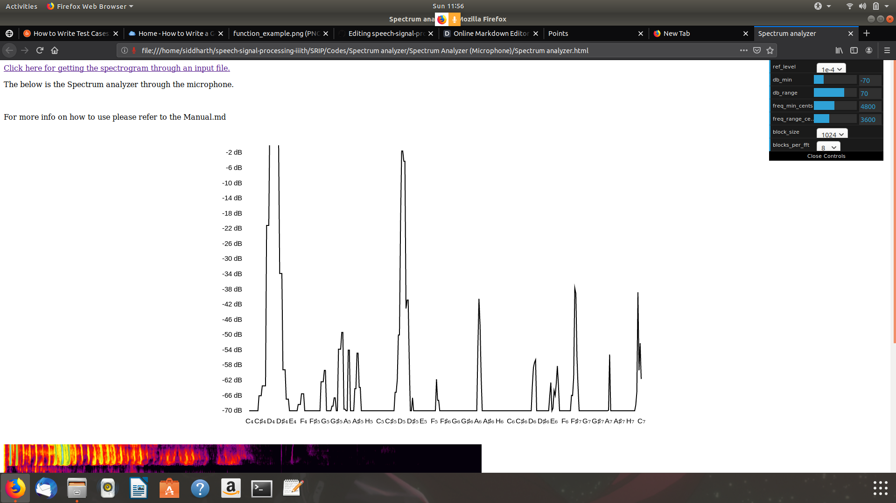
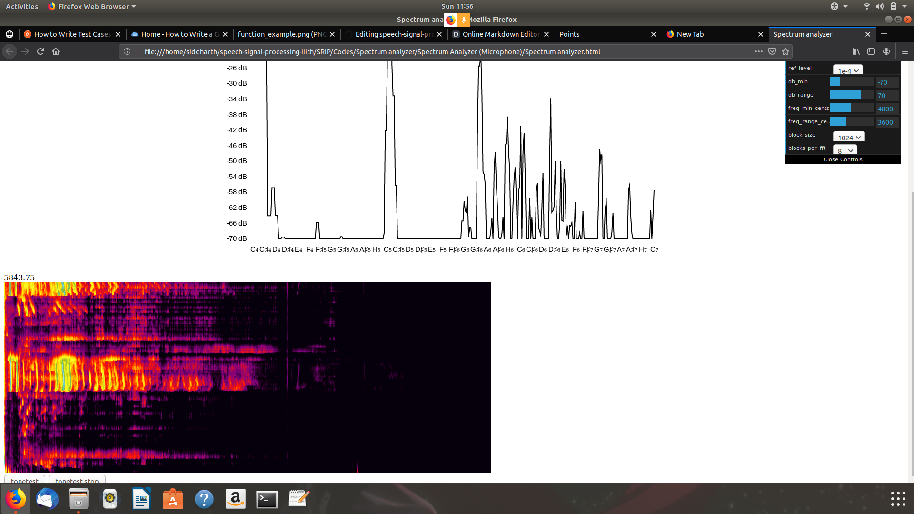
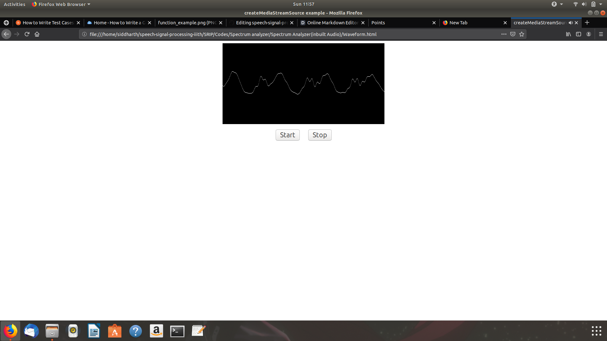
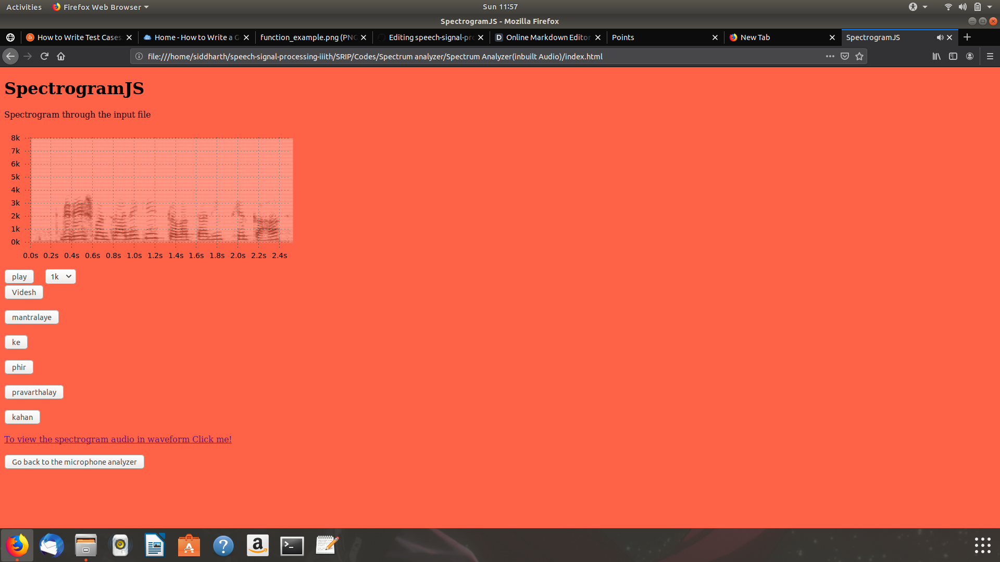

# Spectrographic analysis of speech.

# Scope:
  To find the spectrographic analysis of speech through the microphone as well as through the given audio input.

# Descripton:

A spectrogram is a visual representation of the spectrum of frequencies of a signal as it varies with time. When applied to an audio signal, spectrograms are sometimes called sonographs, voiceprints, or voicegrams. When the data is represented in a 3D plot they may be called waterfalls.

Spectrograms are used extensively in the fields of music, sonar, radar, and speech processing, seismology, and others. Spectrograms of audio can be used to identify spoken words phonetically, and to analyse the various calls of animals. 

[In detail about the spectrogram,Click](https://en.wikipedia.org/wiki/Spectrogram)

# Prerequisites:

This experiment is mainly written in the JS , HTML and CSS.

The foreground of this experiment is that i took a lot of effort and found all types of codes which is available in the internet which i took it as a refernece and wrote it on my own.

In this spectrogram, We are able to visualize the the audio in detail by keeping the block size in "512" and blocks per fft in "8" for the graph.

The spectorgram will be giving the output whenever we talk, It is in the narrow broadband.

[reference for the code](https://developer.mozilla.org/en-US/docs/Web/API/Web_Audio_API/Visualizations_with_Web_Audio_API)

# Procedure:

 It is in the Codes Folder.

 To analyze the code please go to the SRIP folder in that goto the Spectrum analyzer folder.

 In the Spectrum analyzer folder, you will find a "spectrum analyzer.html". 

 It's simple and your browser should allow the permission to access the microphone ,otherwise this experiment won't work.

 If you need to access it directly, press on the below link:

 [Click me](https://github.com/sidrockzz/speech-signal-processing-iiith/blob/master/SRIP/Codes/Spectrum%20analyzer /Spectrum%20analyzer.html)

 To view through the audio file, press the link "Click here for getting the spectrogram through an input file."
 
 To view the waveform press the link in the below to see the in-built audio in it's waveform.
 
 For each and every word it shows spectrographic analysis.
 
# Observation:
 
 
 
 
 
 
 
 
 
# Result:

 The spectrogram is formed through the microphone or through the in-built.
 
# Bottleneck:
 
 The spectrogram can be seen only in the Firefox and Chrome.
 
 To change the audio file, you have to change the path in the code.
 
 If we didn't give permission to access the microphone , then spectrum analyzer doesn't work w.r.t to the microphone.
 
 
# Issues:
  
  If there is any issues occured, please mention it in the issues.
  

# Contact:
  
  For clearing the doubts, raise an issue or contact me though my email : siddu1999@gmail.com

Thank you!!

If you have any issues, please let me know.

To take part in the quiz, goto the Quiz folder which is in the Codes folder itself.
